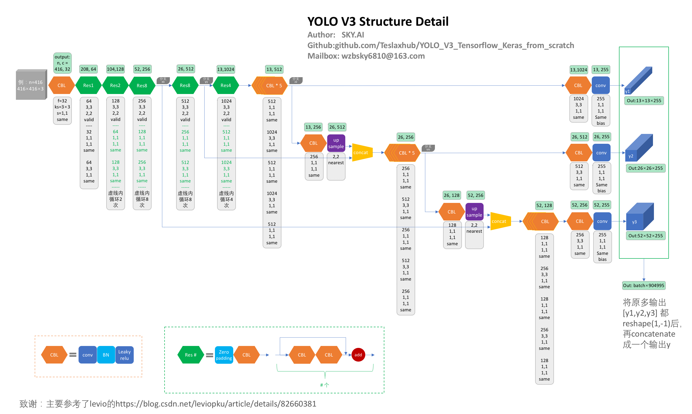

# 前言：

+ 本次利用Tensorflow-Keras实现YOLO-V3模型，目的是更为深入了解YOLO-V3模型的重要结构；
+ 重点研究了模型结构，在[levio](https://blog.csdn.net/leviopku/article/details/82660381)作图的基础上增加了各层的参数设置，将模型展示的更加清晰明了；
+ 实现了较为细节也很重要的非最大值抑制、loss函数、如何生成true label等；
+ 另外做了些测试：图像目标检测、视频实时目标检测测试；
+ 详细代码步骤见：https://github.com/Teslaxhub/YOLO_V3_Tensorflow_Keras_from_scratch   含测试样例；
+ 如有错误，欢迎指正。

<caption>
 Figure 1: YOLO V3 Structure Detail 
</caption>
